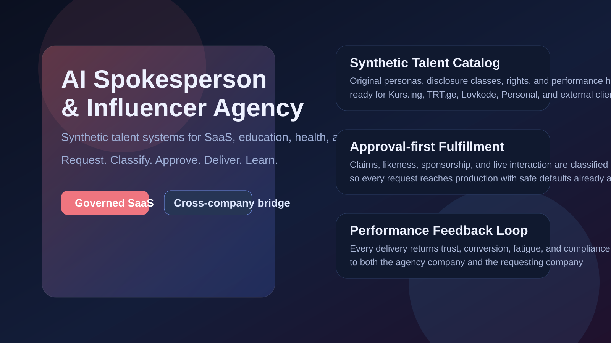
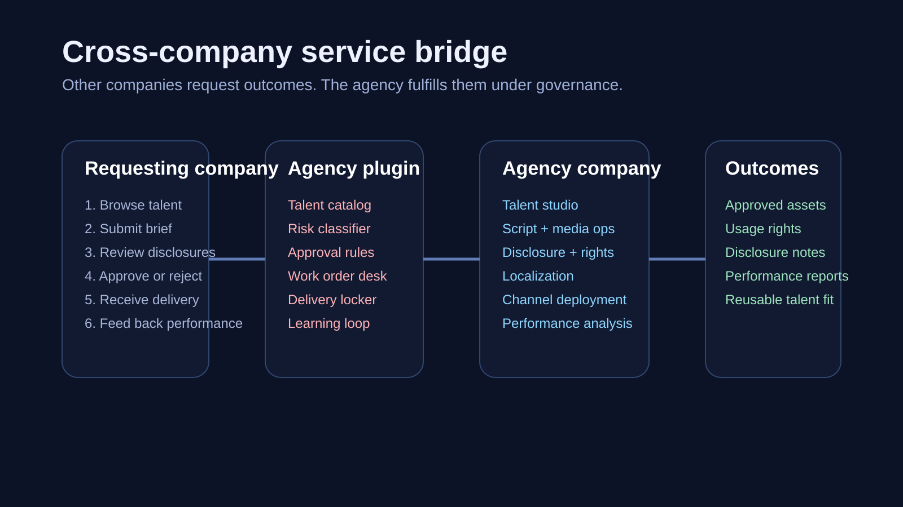
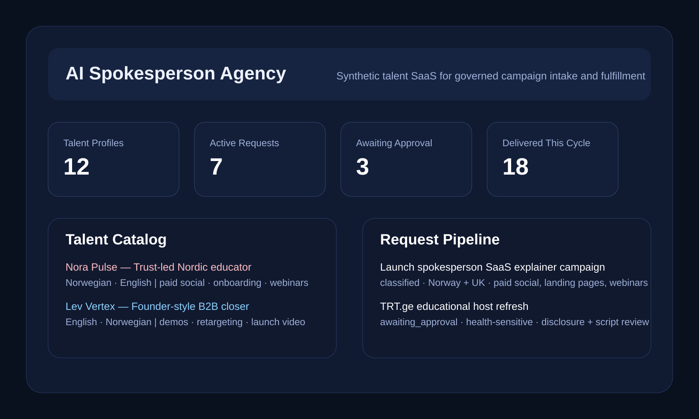

# `paperclip-plugin-ai-spokesperson-agency`

Governed synthetic talent SaaS for Paperclip.

`paperclip-plugin-ai-spokesperson-agency` turns AI influencers and AI spokespersons into a reusable internal and external service. Instead of every company rebuilding its own talent workflows, the plugin gives the portfolio one governed request surface for intake, risk classification, approvals, delivery, rights, and learning.



## Why it sells

Most teams do not need “more AI video.” They need a repeatable spokesperson system that can:

- launch faster than a human talent pipeline
- scale across channels without losing identity
- keep disclosures, approvals, and rights explicit
- return learning back into future campaigns
- work as a portfolio-wide service and as a client-facing SaaS

This plugin is the bridge between demand and fulfillment.

- Requesting companies ask for an outcome.
- The agency company classifies, scopes, produces, and governs it.
- The plugin makes the safe path the easy path.

## What it does

- Browsable talent catalog with reusable spokesperson and influencer profiles
- Structured brief intake for cross-company or client work
- Policy-driven risk classification and disclosure flags
- Approval classes for regulated claims, likeness, sponsorship, live AI use, and multi-market rollout
- Work-order style fulfillment tracking
- Delivery packages with usage rights and disclosure instructions
- Performance feedback loop that compounds talent-market fit over time

## Product flow



1. A company browses available talent or starts a new brief.
2. The plugin classifies risk, disclosure needs, and approval classes.
3. Recommended talent is matched to market, channel, and trust profile.
4. The agency fulfills the request through governed work orders.
5. Approved deliverables are returned with clear rights and usage boundaries.
6. Performance data feeds back into future talent matching and creative iteration.

## Built for SaaS and portfolio operations

This plugin is designed for:

- portfolio companies such as Kurs.ing, TRT.ge, Lovkode, Personal, and EmDash
- external client deployments that need synthetic spokesperson systems as a managed service
- multi-market brands that need one spokesperson layer across many channels
- sensitive categories where approval and disclosure cannot be an afterthought

## Live surfaces in Paperclip

The plugin ships with:

- a full page: `AI Spokesperson Agency`
- a dashboard widget for company-level visibility
- a sidebar entry for persistent access
- a settings page for disclosure and rights defaults
- agent tools for talent browsing, request creation, request lookup, and feedback capture
- a scheduled daily digest job for request and approval monitoring



## Key approval classes

- `approve_spokesperson_campaign`
- `approve_regulated_claim_script`
- `approve_founder_likeness_use`
- `approve_sponsored_synthetic_endorsement`
- `approve_live_ai_spokesperson_launch`
- `approve_multi_market_spokesperson_rollout`

## Default policy posture

- Original synthetic talent is the default
- Sponsorship and AI-origin disclosure are explicit
- Health, legal, finance, tax, and other high-trust categories escalate automatically
- Interactive spokesperson launches require stronger review
- Rights and usage boundaries ship with the delivery package

## Technical notes

- Paperclip plugin type: cross-company service and fulfillment bridge
- Target runtime: authenticated/private Paperclip deployments
- Current version: `0.1.0`
- Build output:
  - `dist/manifest.js`
  - `dist/worker.js`
  - `dist/ui/index.js`

## Local development

```bash
npm install
npm run assets:generate
npm run plugin:build
npm test
```

## Asset generation

The README visuals are generated from `scripts/generate_readme_assets.py` so the sales assets stay reproducible and editable.

## SaaS packaging direction

This repo is intentionally shaped as the service bridge layer for a larger company:

- talent SaaS
- managed spokesperson retainers
- campaign fulfillment
- multilingual rollout packages
- approval-heavy category deployments

That makes it usable both inside your own Paperclip portfolio and as a client-facing SaaS product once attached to company 8.
